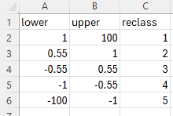

```{r, include = FALSE}
knitr::opts_chunk$set(
  collapse = TRUE,
  comment = "#>"
)
```


## Purpose
The next stage is to calculate both trends and trend classes for easy 
interpretation. Vegetation classes can jump around, especially on the edges of 
mangroves, however trends give a better longer term perspective on what changes 
are occurring. The raster outputs can be used to spatially visualise where change 
is occurring and will later be used as inputs to calculate areas.

## Use the trend_class() function
The `trend_class()` function will perform a per pixel linear regression and then 
classify the values into 5 bins which correspond to the trend classes from 
VegMachine; minor gain, major gain, stable, minor loss and major loss.

The bins are drawn from the `supplementary/trend_classes.csv` and like other 
supplementary data should be checked for validity for your area of interest. The 
trend class bins look like the below.



```{r, trend_class, eval=FALSE}
# The general form of the function is (NOTE the default parameters)
# trend_class(irast, areaname, end, period = 10, classes = "supplementary/trend_classes.csv", ext = ".tif")

# We  need to assign three of the parameters as the other defaults are fine
irast <- "veg_dens_mskd_cld"
areaname <- "lgscmp"
end <- 2023

# Run the function
trend_class(irast, areaname, end = 2023)
```

* **irast** - input vegetation density directory.

* **areaname** - a geographical area or marine park name for the output rasters.

* **end** - the end year of the time series to consider (usually the latest).

## What's going to happen?
Two rasters are going to be created. One will be to show the per pixel result of 
the regression. The second will be the same data but reclassed according to the 
trend class bins in the supplementary csv. 

**NOTE on regression time periods** The default period for the regressions is 10 
years and any missing years will be buffered (dummy year inserted). The user can 
choose any period but no less than 3. Be aware though that identical slope values 
over different period lengths can equate to drastically different amounts of 
absolute change. The classification bins shipped with the data have been determined 
for a 10 year period and will be either too sensitive or not sensitive enough to 
other period lengths.

**NOTE on cloud handling in regressions**
If pixels have been encoded as cloud, the value is swapped to NA as any numerical 
value will adversely affect the regression.
