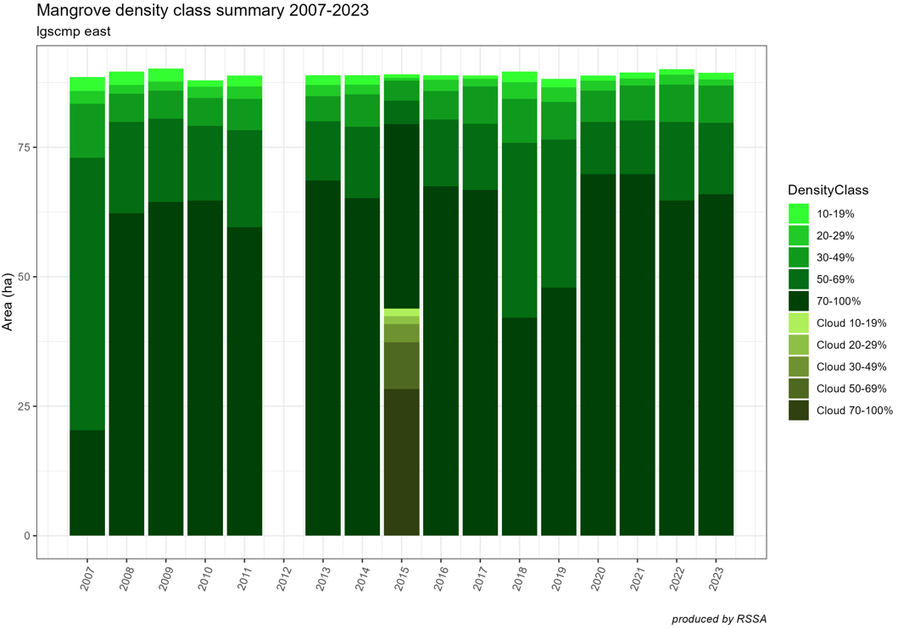
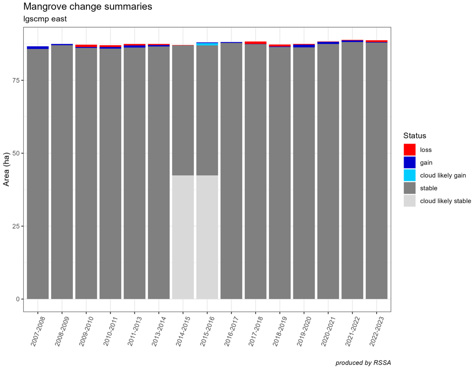

```{r, include = FALSE}
knitr::opts_chunk$set(
  collapse = TRUE,
  comment = "#>"
)
```


## Purpose
A plot is a great way to summarise statistics and the `groveR` package ships 
with functions to create two, one for a vegetation density class and the other 
for extent change.

## Use the `...plot()` functions
The plots created are stacked barcharts. They also use some of the area 
calculations that have already been run. Each function will output one plot per 
unique region/site combination found in the csv file.

The `veg_dens_class_plot()` function uses the csv output from running the 
`veg_class_area()` function which is found in the `extent_summaries/` directory.

```{r, veg_plot, eval=FALSE}
# The general form of the function is (NOTE there are no default parameters)
veg_dens_class_plot(icsv, areaname, cap)

# We  need to assign all of the parameters
icsv<- "extent_summaries/LGSCMP_2007-2023_extent_summaries.csv"
areaname <- "LGSCMP"
cap <- "produced by RSSA"

# Run the function
veg_dens_class_plot(icsv, areaname, cap)

```


* **icsv** - input csv. It will only work with the extent summaries csv as output 
from the `veg_class_area()` function.

* **areaname** - a geographical area or marine park name for the plot output.

* **cap** - whatever is input here appears as a caption below the plot. If nothing 
is required use "".

The `extent_change_plot()` function uses the csv output from running the 
`extent_change()` function which is found in the `extent_change/` directory.

```{r, extent_plot, eval=FALSE}
# The general form of the function is (NOTE there are no default parameters)
extent_change_plot(icsv, areaname, cap)

# We  need to assign all of the parameters
icsv<- "extent_change/LGSCMP_2007-2023_extent_change.csv"
areaname <- "LGSCMP"
cap <- "produced by RSSA"

# Run the function
extent_change_plot(icsv, areaname, cap)

```


* **icsv** - input csv. It will only work with the extent change csv as output 
from the `extent_change()` function.

* **areaname** - a geographical area or marine park name for the plot output.

* **cap** - whatever is input here appears as a caption below the plot. If nothing 
is required use "".

## What's going to happen?

Running `veg_dens_class_plot()` will create a plot like this:




Note that there was no data for 2012.


Running `extent_change_plot()` will create a plot like this:



Note that with 2012 data missing from the time series, the chart displays change 
in extent between data for 2011 and 2013.

**NOTE on plotting**. Plots can be made in a variety of styles, focus on certain 
data ranges only or be formatted in a multitude of ways. It is beyond the scope 
of this package to attempt to provide code to anticipate all of these options. The 
data in the csv's is however in an easily manipulated format. For ideas on how to 
manipulate the data to construct alternate plots please examine the code for these 
two functions in the GitHub repository.

If you have been following along the vignettes in order, this one is the last 
describing a typical workflow using the `groveR` package. Happy processing!
