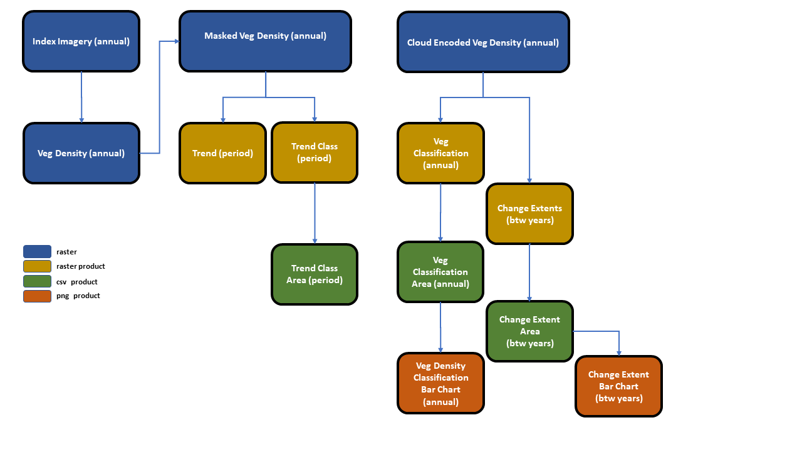

```{r, include = FALSE}
knitr::opts_chunk$set(
  collapse = TRUE,
  comment = "#>"
)
```


# Introduction
This package is all about bringing together a standard work flow that utilises 
satellite data to monitor mangroves. It focuses on taking annual satellite data 
through a number of processing steps to produce useful vegetation cover and 
change metrics. 




Whilst the focus is mangroves, many of the processing steps are generalisable 
to other vegetation types and the package should be handy for other studies.

The utilities provided by this package include:

1. Conversion of vegetation index data to a cover metric (user supplied model).

2. Generalised masking duties, i.e. end members common to all time steps such as 
water or non-target areas (user supplied masks).

3. Masking of unwanted end members in specific images, e.g. clouds, (user 
supplied cloud masks).

4. Perform a vegetation classification (user supplied classes) where continuous 
cover values are binned into categories. It can also perform probable classification 
where pixel have been obscured by cloud.

5. Outputs area metrics based on the vegetation classification and will summarise 
them to reportable regions and sites (user supplied shape file).

6. Generate trend and trend class rasters on desired time periods (user supplied 
trend classes).

7. Outputs area metrics based on the trend class classification and will summarise 
them to reportable regions and sites (user supplied shape file).

8. Generate the change in extent of mangroves with output area metrics and change 
between consecutive time step rasters.

9. Lastly, some stacked barcharts illustrating vegetation densities and change 
in extent.

This package attempts to bring all of the above processes into one environment that 
will aid in streamlining the workflow with the benefits of both reduced error and 
speed. 

Somethings are not generalisable so this is not a "one click" solution to remote 
sensing of vegetation. Care must be taken with projections, data extents and 
outputs should be "sanity checked" along the way. As such every function in the 
package produces outputs which are probably superfluous to the end monitoring 
program but very handy to understand what is going on and where a possible error 
may have occurred.

I would suggest using a standard processing directory setup which will not only 
aid in keeping things neat and tidy but will help in finding all of the 
outputs. More on this later.

If this is your first time using the package please have a go at following along 
with the included data and the vignettes to follow.
