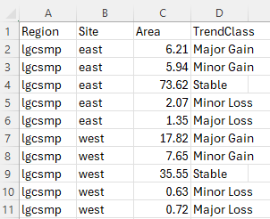

```{r, include = FALSE}
knitr::opts_chunk$set(
  collapse = TRUE,
  comment = "#>"
)
```


## Purpose
This stage is similar to calculating the vegetation class areas however this time we 
are calculating the trend class areas.

## Use the trend_class_area() function
The `trend_class_area()` function takes the trend class bins and reports on their 
respective areas. In order to report effectively, a region needs to be delineated. 
This boundary needs to be supplied in a shapefile. Convention has it that an attribute column, 
named "region" contains a region name and a site name separated by an underscore. 
An example might be "lgscmp_east", "lgscmp_west" etc. This should be the same shapefile that was 
used when running the `veg_class_area()`.

```{r, trend_class_area, eval=FALSE}
# The general form of the function is (NOTE there are no default parameters)
# trend_class_area(irast, iregions, attribname)

# We  need to assign all three of the parameters
irast <- "trend_class/lgcsmp_lsat_2014-2023_trendclass.tif"
iregions <- "vectors/regions.shp"
attribname <- "regions"

# Run the function
trend_class_area(irast, iregions, attribname)

```

* **irast** - file path to the trend class raster for a distinct period that has 
been written to the `trend_class\` directory. If multiple periods (and rasters) 
exist, run the function for them one at a time.

* **iregions** - file path to a shapefile denoting the reporting region.

* **attribname** - the name of the attribute column containing region information.

## What's going to happen?
A csv of areas in hectares will be output to the `trend_class\` directory and will look 
similar to this.


