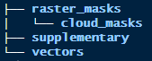

```{r, include = FALSE}
knitr::opts_chunk$set(
  collapse = TRUE,
  comment = "#>"
)
```


## Install and load the package
You only need to install the package once (unless you are updating it). The 
package lives on GitHub so you will need `devtools` to install.

```{r, install, eval=FALSE}
# Install and load groveR
# install.packages("devtools")
devtools::install_github("dbca-wa/groveR")
library(groveR)
```

Once this is done you need to set up a standard processing environment.


## Why?
The functions in this package are going to require access to various data and 
will produce raster and csv products. If everything is located in a standard 
structure your analysis will run smoother and you won't be inclined to lose 
anything.

## How?
It is strongly recommended that you use an RStudio project. Either create one 
from scratch or create one from an existing directory. This will now become your 
working directory and all file paths are relative to this. If you do not wish to 
use RStudio then the same effect can be achieved by setting your working directory 
to a folder that makes sense to you.

The next stage is to use `groveR` to setup a directory tree. These folders will 
be used to house various data and many of `groveR's` functions will default to 
looking in them for required data.

```{r, folders, eval=FALSE}
# Make the sub-directories in the processing folder
make_folders(p =".")
```


## What does it look like?
The sub-directories have the following structure:



These directories will contain user supplied data:

* `raster_masks/` will contain "general" raster masks of the type that will be 
applied to all satellite data.

* `raster_masks/cloud_masks/` will contain "specific" raster masks that will be 
applied only to certain satellite data dates.

* `supplementary/` will contain three csv files. One each to describe calibration 
coefficients, density classes and trend classes.

* `vectors/` will contain a shape file that delineates the region that output area 
stats are generated for.


## What's next?

The starting point for this workflow is a directory containing pre-generated 
annual vegetation index rasters that cover an area to be reported on. These index 
rasters, one per year, will have been chosen on the basis of:

* An appropriate index, when used in a model, provide the best measure of cover.
* That the time of capture is the same for all time steps i.e. the same season.
* That they are free from cloud. Where cloud is unavoidable, the cloud has either 
been digitised and a corresponding shape file has been stored in `vectors/`, or 
a cloud mask has been created and stored in `raster_masks/cloud_masks/`.
* That they cover the whole area of interest. If the area of interest is larger 
than an available satellite scene, they have been mosiacked together.
* That they all have identical extents (footprints) and pixel sizes.

The above data will be large and as such may not be located in the 
**Processing Folder**. You will however need to know where it is and be able to 
provide a file path to it's location.

The other data that you will need to provide will be stored in the appropriate 
sub-directories of the described **Processing Folder**. Ensure any masks have 
the same extents and pixel sizes as the annual rasters. The required csv files 
will be described in detail later in the vignettes as will any shape file.

## A Note on Projections
Any data that is used for your analysis must have a consistent projection. As 
reporting areas used in mangrove monitoring can straddle more than one UTM zone, 
Albers Australia (EPSG: 3577) has been used as a default. This is a reasonable 
choice as it enables easy calculation for area in metres and UTM zones are not 
an issue. All outputs will be in EPSG:3577 and functions will check and re-project 
inputs if they differ.

## Another Note - Example Data
Shipped with this package is example data from the Kimberley's. The following 
vignettes will make use of this data to demonstrate capabilities. The next 
vignette will describe how to extract the example data from the package into the 
**Processing Folder** sub-directories.


