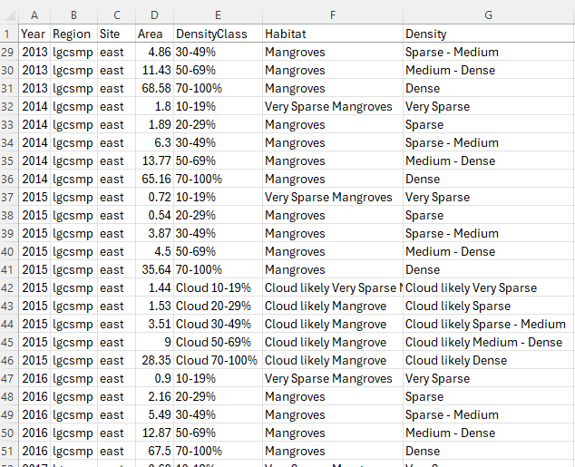

```{r, include = FALSE}
knitr::opts_chunk$set(
  collapse = TRUE,
  comment = "#>"
)
```


## Purpose
The next step is to calculate the area of each vegetation class per year. The 
tabulated results can then be used to create plots.


## Use the veg_class_area() function
The `veg_class_area()` function takes the reclass bins and reports on their 
respective areas. In order to report effectively, a region needs to be delineated. This boundary 
needs to be supplied in a shapefile. Convention has it that an attribute column, 
named "region" contains a region name and a site name separated by an underscore. 
An example might be "lgscmp_east", "lgscmp_west" etc.

```{r, veg_class_area, eval=FALSE}
# The general form of the function is (NOTE the default parameters)
# veg_class_area(irast, iregions, attribname, areaname, ext = ".tif", probabilities = TRUE)

# We  need to assign four of the parameters as the other defaults are fine
irast <- "veg_class"
iregions <- "vectors/regions.shp"
attribname <- "regions"
areaname <- "lgscmp"

# Run the function
veg_class_area(irast, iregions, attribname, areaname)

```

* **irast** - input vegetation classification directory.

* **iregions** - file path to a shapefile denoting the reporting region.

* **attribname** - the name of the attribute column containing region information.

* **areaname** - a geographical area or marine park name for the output csv.

## What's going to happen?
A csv of areas in hectares will be output to the `extent_summaries\` directory and will look 
similar to this.



The above shows the example data for 2013-2016 and also demonstrates what happens 
if there was cloud in one of the mosaics (2015) and the default parameters were used. The 
`probabilities = TRUE` parameter tells the function that if a pixel is cloudy then 
report on what it might have been considering what the pixel was the year before. 
If you change the default to `probabilities = FALSE` then just the area of cloud 
is reported on.


