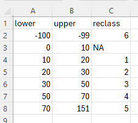

```{r, include = FALSE}
knitr::opts_chunk$set(
  collapse = TRUE,
  comment = "#>"
)
```


## Purpose
The vegetation density rasters, whilst useful, presently contain continuous 
values which are a little unwieldy when analysing and summarising. The next step 
in the processing workflow is to "bin" the continuous values into meaningful 
groupings.

## Use the veg_class() function
We now apply the `veg_class()` function to our masked veg density outputs. If there 
has never been cloud in any of the mosaics then you can use the `veg_dens_mskd\` 
directory (lucky you), however the `veg_dens_mskd_cld\` directory is the alternative. 
The function will apply the user determined density classes found at 
`supplementary/density_classes.csv`. The example shipped with the package most 
likely contains the correct values but as always, if unsure please check. Below 
is a screenshot of shipped data, make sure you follow the same format if changes 
are required.



The above example shows the lower and upper limits to bin the continuous values 
into the reclass value. Here, densities of between 0-10 are ignored and values 
above this fall into 5 density bins (1-5). The reclass value of 6 is reserved for 
cloud (cloud masking encoded the affected pixels to -99 in a prior step).

```{r, veg_class, eval=FALSE}
# The general form of the function is (NOTE the default parameters)
# veg_class(irast, ext = ".tif", classes = "supplementary/density_classes.csv")

# We only need to assign one of the parameters as the defaults are fine
irast <- "veg_dens_mskd_cld"

# Run the function
veg_class(irast)

```

* **irast** - input vegetation density directory.

## What's going to happen?
The input vegetation density rasters will be reclassified according to the density 
classes provided in the csv file and will be written to `veg_class/` directory. 
Whilst these raster layers can be useful as visualisations, in this workflow they will 
be summarised by area and this will be covered in the next vignette.
