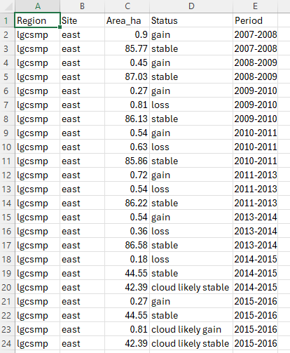

```{r, include = FALSE}
knitr::opts_chunk$set(
  collapse = TRUE,
  comment = "#>"
)
```


## Purpose
Over time area of mangroves increase and decrease in response to various drivers 
such as new habitat creation and cyclone activity amongst others. This function 
calculates change between all consecutive  vegetation classification rasters. It 
then outputs extent change area statistics as well as extent change shape files 
to visualise where change has occurred.

## Use the extent_change() function
The `extent_change()` function compares all the vegetation classification rasters 
previously created by running `veg_class()`, calculates change in area and also 
outputs shape files to spatially show where change is occurring. There are six 
categories reported on; loss, gain, stable and their cloudy probability equivalents. 

In order to report effectively, a region needs to be delineated. This boundary 
needs to be supplied in a shape file. Convention has it that an attribute column, 
named "region" contains a region name and a site name separated by an underscore. 
An example might be "lgscmp_east", "lgscmp_west" etc. This should be the same 
shape file that was used when running the `veg_class_area()` and/or the 
`trend_class_area()`.

```{r, extent_change, eval=FALSE}
# The general form of the function is (NOTE there are no default parameters)
# extent_change(irast, iregions, areaname, attribname)

# We  need to assign all four of the parameters
irast <- "veg_class"
areaname <- "LGSCMP"
iregions <- "vectors/regions.shp"
attribname <- "regions"

# Run the function
extent_change(irast, areaname, iregions, attribname)

```

* **irast** - input vegetation classification directory.

* **areaname** - a geographical area or marine park name for the output csv.

* **iregions** - file path to a shape file denoting the reporting region.

* **attribname** - the name of the attribute column containing region information.

## What's going to happen?
A csv of areas in hectares will be output to the `extent_change\` directory and will look 
similar to this.



Note that change between consecutive years is calculated and in the example there 
are some cloudy years.

Shape files are also created for each comparison year/site combination. All are 
written to the `extent_change\` directory.
