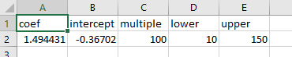

```{r, include = FALSE}
knitr::opts_chunk$set(
  collapse = TRUE,
  comment = "#>"
)
```


## Introduction
The following articles or vignettes are intended to provide an example of how to 
process index rasters through to final analysis products. They are designed to 
be helpful and to get a user started. They do not however contain all the information 
about `groveR's` functions as there is comprehensive help available in two places. 

The first and perhaps easiest place to look for detailed information on any of the 
functions is under the **Reference** tab on `groveR's` website.

The second is through a search in the **Help** tab in RStudio or by typing  
`??NameOfFunction` in the R console which will return familiar R documentation help 
(provided you have loaded the `groveR` package).

## Purpose
This is where the processing really begins. A vegetation index will be converted to 
a cover metric which will make all outputs more meaningful. There will have been 
a lot of work done prior to this stage. Field measures of cover will have been 
regressed with a variety of vegetation indices to find the best relationship. 
That work will have resulted in an index being chosen for the annual data plus 
model coefficients being recorded in the calibration csv file.

## Calibration file
This csv file holds the model coefficients that when applied to the index rasters, 
will convert them to a measure of cover. It should be located in the 
**Processing Folder** in `supplementary/`. The csv needs to have the following 
format:



Please ensure the column names are as indicated above. The names mean:

**coef** - the model coefficient.

**intercept** - the model intercept.

**multiple** - a multiple to turn the model output to a percentage.

**lower** - a lower limit to apply to the veg density. In this instance we are not 
interested in densities below 10%.

**upper** - an upper limit to apply to the veg density. 

## Use the veg_dens() function
Lets run the `veg_dens()` function. The following code block uses the data we have set up 
previously. If using your own data change the parameters to suit. Below I assign 
all the parameters to variables and pass those to the function. I find this 
neater and will do this in the remaining vignettes. Alternatively you can input the 
parameters directly to the function.

```{r, veg_dens, eval=FALSE}
# The general form of the function is (NOTE the default parameters)
veg_dens(irast, areaname, ext = ".tif", calibration = "supplementary/calibration.csv")

# We only need to assign the first 2 parameters as the defaults are fine
irast <- "index_rasters"
areaname <- "lgscmp"

# Run the function
veg_dens(irast, areaname)
```

* **irast** - input index rasters directory.
* **areaname** - a geographical area or marine park name that will be pre-pended 
to the output file names.

## What's going to happen?
A new directory will be created, `veg_dens/` and vegetation density rasters will 
be written to it. These will be the inputs for the next function.

