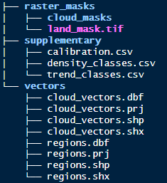
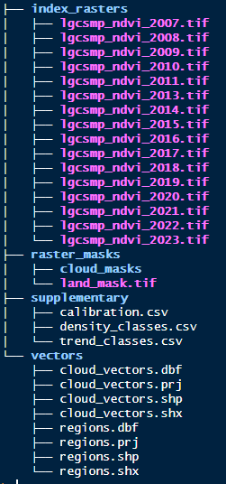

```{r, include = FALSE}
knitr::opts_chunk$set(
  collapse = TRUE,
  comment = "#>"
)
```


## Purpose
The best way to get a handle on this package is to try it out with the example 
data. The following will guide you through putting the example data into the 
suggested **Processing Folder** directory.


## Populate with data
At this point either fill the directories with the example data or if 
you are an old hand at this, use your own data. If using your own data you can skip 
this bit and start the next vignette.

So at this stage you have the initial folders setup. Run the following code to 
save the example data to where it needs to be.

```{r, data_setup, eval=FALSE}
# Access internal dummy user data and write to sub-directories
make_example_data(p = ".")
```

After running that your directories should look like this:




## Example index data
Often the starting index raster data wouldn't be stored within the 
**Processing Folder** as it would be large and the result of other processing 
steps, such as mosaicking. For the purposes of demonstration, however, we will 
store the example index raster here. Note the code below will also create a folder, 
`index_rasters/`.

```{r, index_raster, eval=FALSE}
# Access internal dummy index data and write to sub-directory
make_index_rasters(p = ".")
```

After running that your directories should look like this:



## What have we got?
The index raster data is a small subset in area and time (2007-2023) from a 
monitoring program in Lalang-Garram Camden Sound Marine Park in the Kimberley 
region Western Australia. Data for 2012 is purposefully missing to demonstrate 
some behaviours (more on this later) and is in tif format. Note that tif format 
is preferred but functions do allow for other formats.

There is also a land mask. 

In the supplementary directory is a calibration file (model coefficients) to 
transform the index to vegetation densities. There are also density and trend 
class csv files to provide bins for classification.

Lastly there are a couple of shapefiles in the vectors directory. One provides 
boundaries for both a fictitious reporting region and some sites within it. The 
other provides ficticious digitised clouds which will be converted later to cloud 
masks.

**NOTE on naming**. The functions in `groveR` will consistently name each interim 
product based on user provided parameters (function specific) and a 4 digit year 
which must be part of the index image name. Please do not include other numbers 
in your naming convention. Something simple like the example data is recommended.

**NOTE on supplementary data**. The supplementary data shipped with the package, 
whilst a good start for mangrove analysis, may not be the most applicable to 
your area of interest. Always check with *Kathy Murray* from the *RSSA Program* 
before running on your area of interest. If you are starting a new area of study 
where no work has been done before, please use these supplementary csv files as 
a guide. The format and column headings are important.

