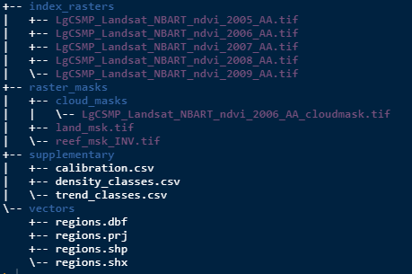

```{r, include = FALSE}
knitr::opts_chunk$set(
  collapse = TRUE,
  comment = "#>"
)
```


## Purpose
The best way to get a handle on this package is to try it out with the example 
data. The following will guide you through putting the example data into the 
suggested **Processing Folder** directory.


## Populate with data
At this point either fill the directories with the example data or if 
you are an old hand at this, use your own data. If using your own data you can skip 
this bit and start the next vignette.

So at this stage you have the folders setup and the is your 
working directory. Run the following code to save the example data to where it 
needs to be.

```{r, data_setup, eval=FALSE}
# Access internal dummy user data and write to sub-directories
make_example_data(p = ".")
```

After running that your directories should look like this:


## Example index data
Often the starting index raster data wouldn't be stored within the 
**Processing Folder** as it would be large and the result of other processing 
steps, such as mosaicking. For the purposes of demonstration, however, we will 
store the example index raster here. Note the code below will also create a folder, 
`index_rasters/`.

```{r, index_raster, eval=FALSE}
# Access internal dummy index data and write to sub-directory
make_index_rasters(p = ".")
```

After running that your directories should look like this:



## What have we got?
The index raster data is a small subset in area and time (2005-2009) from a 
monitoring program in Lalang-Garram Camden Sound Marine Park in the Kimberley 
region Western Australia.

**NOTE on naming**. Its always good to maintain a naming convention that shows 
the provenance of the imagery data. The name of the data used here for example 
indicates that the data is Landsat NBART, for the LgSCMP, it is NDVI, shows the 
year and that it is projected to Albers Australia.

There is both a land and a reef mask to suit as well as cloud mask for the 2006 
index raster. The reef mask is an example of an inverse mask (more on this later).

In the supplementary directory is a calibration file (model coefficients) to 
transform the index to vegetation densities. There are also density and trend 
class files for classification.

Lastly there is a shape file in the vectors directory which gives boundaries for 
both a fictitious reporting region and some sites within it.
